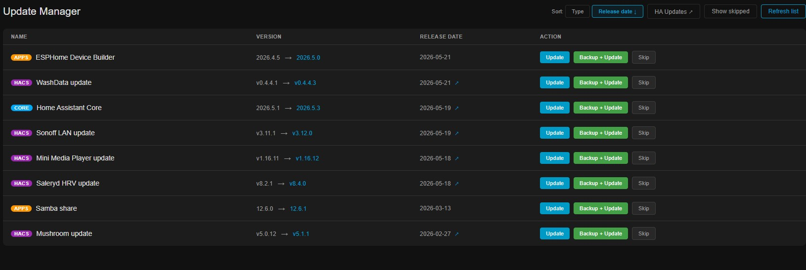
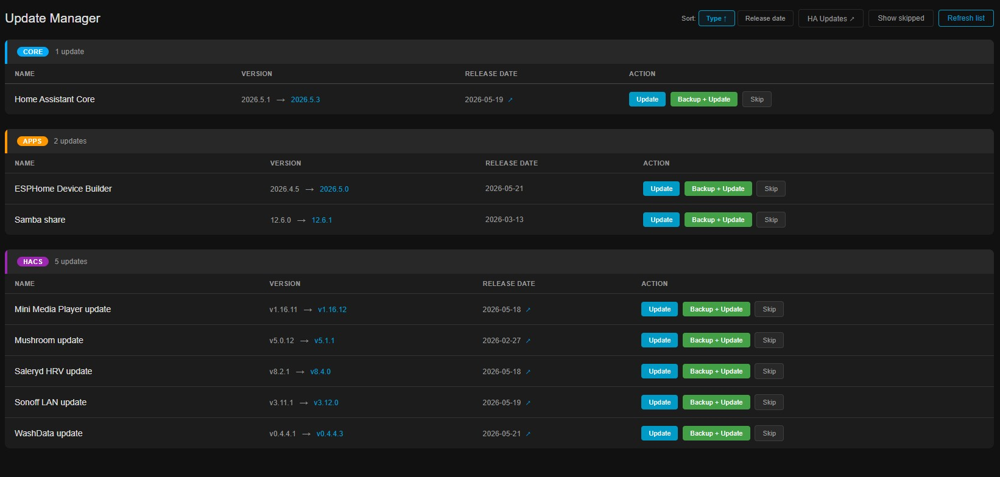
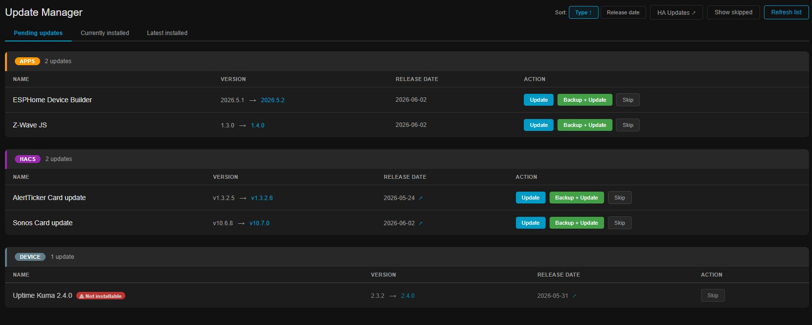
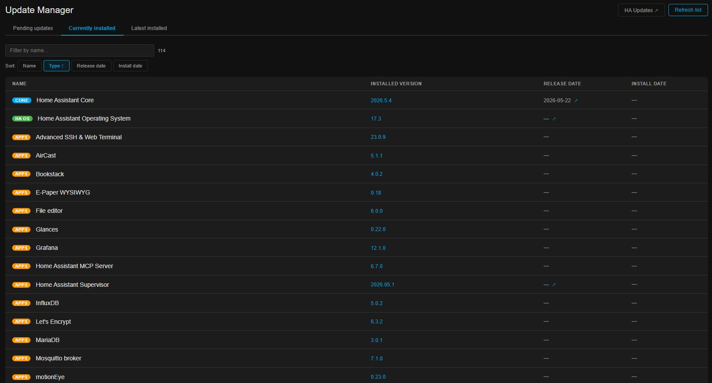
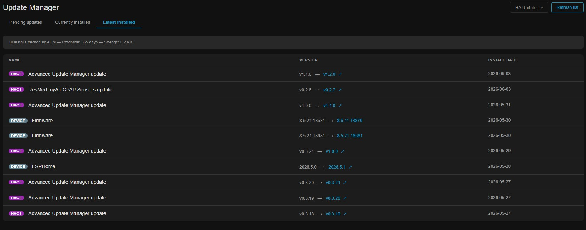

# Home Assistant Advanced Update Manager

A HACS custom integration that adds a dedicated **Update Manager** panel to your Home Assistant sidebar — with enriched information that the built-in update UI doesn't show..

## Features

- **All update types in one view** — Core, HA OS, Add-ons, HACS integrations, Device firmware, and Other
- **Real release dates** — fetched from GitHub and cached persistently (survives restarts)
- **Direct links** to release notes for each update
- **Backup before update** — one-click backup + install
- **Skip** a specific version without losing the update notification
- **Real-time sync** — automatically reflects updates installed via the normal HA UI
- **Sensor entities** — expose update statistics to dashboards, automations, and scripts

## Installation via HACS

1. Open HACS in your Home Assistant
2. Go to **Integrations** → click the three-dot menu → **Custom repositories**
3. Add `https://github.com/finbom/HomeAssistantAdvancedUpdateManager` with category **Integration**
4. Click **Add** → search for "Advanced Update Manager" and install it
5. Restart Home Assistant
6. Go to **Settings → Devices & Services → Add Integration** and search for "Advanced Update Manager"
7. Click **Submit** — a new **Update Manager** entry appears in the sidebar

## Manual installation

1. Copy `custom_components/advanced_update_manager` into your HA config's `custom_components/` directory
2. Restart Home Assistant
3. Go to **Settings → Devices & Services → Add Integration** and search for "Advanced Update Manager"

## How it works

- The integration registers itself as a **custom panel** in HA's sidebar (not an add-on, no separate Docker container)
- It runs inside HA's own process and subscribes to `update.*` entity state changes
- Release dates are fetched from the GitHub Releases API and stored persistently in `.storage/advanced_update_manager.json`
- Updates installed via the normal HA UI are automatically removed from the panel's list

## Sensors

Advanced Update Manager creates a set of HA sensor entities grouped under a single **Advanced Update Manager** device in **Settings → Devices & Services**. Use them in dashboards, automations, and scripts.

| Sensor | Example value | Description |
|--------|--------------|-------------|
| **Pending Updates** | `7` | Total pending updates. Attributes include per-type counts: `core`, `haos`, `addon`, `hacs`, `device`, `other`. Ideal for sidebar badges or notification automations. |
| **Oldest Pending Update** | `47 days` | Age in days of the oldest available update (based on release date). Attributes identify the specific update. |
| **Days Since Last Install** | `12 days` | The "accident counter" — days since anything was installed. Resets to `0` on every install. Attributes show what was last installed. |
| **Last Installed** | `ESPHome 2025.5.1` | Name and version of the most recently installed update. Attributes include entity ID, type, from/to version, and install date. |
| **Updates Released This Week** | `4` | Number of pending updates released in the last 7 days. Spikes after major HA releases. |
| **Major Version Updates Pending** | `1` | Count of updates where the major version number changed — a proxy for breaking changes. Attributes list the specific updates. |
| **History Log Size** | `48 KB` | Size of the persistent storage file on disk. Use in automations to alert when the log grows unexpectedly large. |
| **Total Installs** | `312` | Lifetime count of all tracked installs in the retained history. |
| **Avg Days Release to Install** | `4.2 days` | Average time between a release being published and you installing it — your personal update hygiene score. |
| **Longest Gap Without Update** | `34 days` | All-time record of the longest gap between consecutive installs — your personal best on the "accident counter". |
| **Most Updated Integration** | `ESPHome` | The integration you have updated most often. Attributes include the install count and entity ID. |

## Update types

| Badge | Meaning |
|-------|---------|
| Core | Home Assistant Core |
| HA OS | Home Assistant Operating System |
| Add-on | Supervisor add-ons |
| HACS | HACS integrations, cards and themes |
| Device | Device firmware (ESPHome, Z-Wave, etc.) |
| Other | Anything else |

## Language / Translations

The panel automatically uses the same language as your Home Assistant UI (set under **Profile → Language**).

If no translation file exists for your language, the panel falls back to **English**.

### Currently supported languages

| Language | File |
|----------|------|
| English | `en.json` (default / fallback) |
| Swedish | `sv.json` |

### Contributing a translation

1. Fork this repository
2. Copy `custom_components/advanced_update_manager/frontend/translations/en.json` to a new file named with your language code (e.g. `de.json` for German, `nl.json` for Dutch — use the [BCP 47](https://www.iana.org/assignments/language-subtag-registry/language-subtag-registry) language tag that Home Assistant uses)
3. Translate all values in the new file — **do not change the keys**
4. Open a pull request

That's it. No changes to any Python or JavaScript files are needed.

## Screenshots

Sort by release date.

Sort by update type. (Core, HACS, Apps etc...)

Another screenshot.

View for what is currently installed.

View for what has been installed.

## License

MIT
